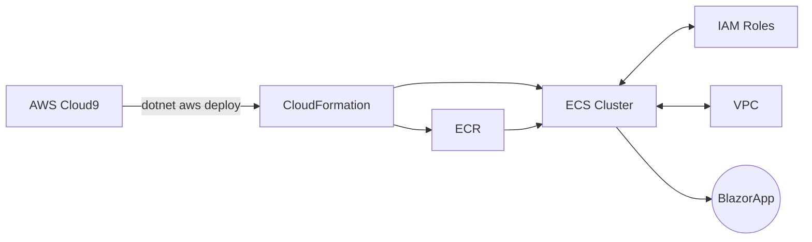
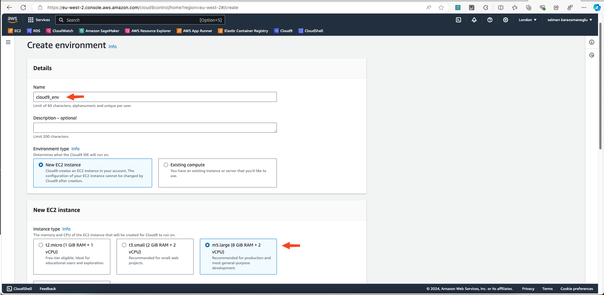
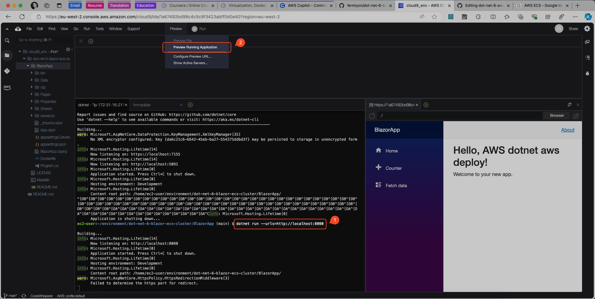
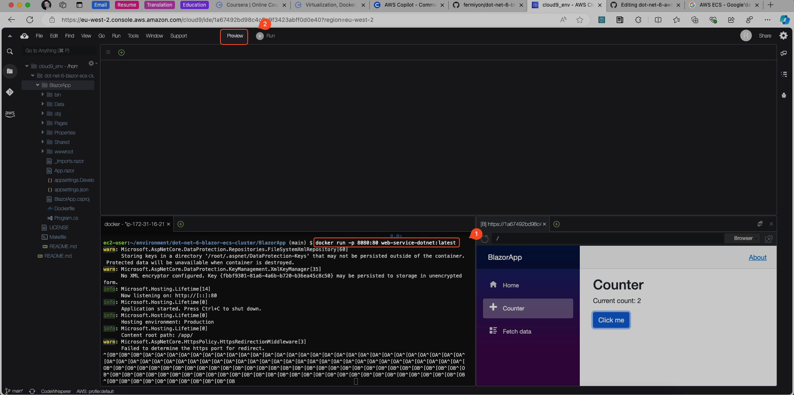
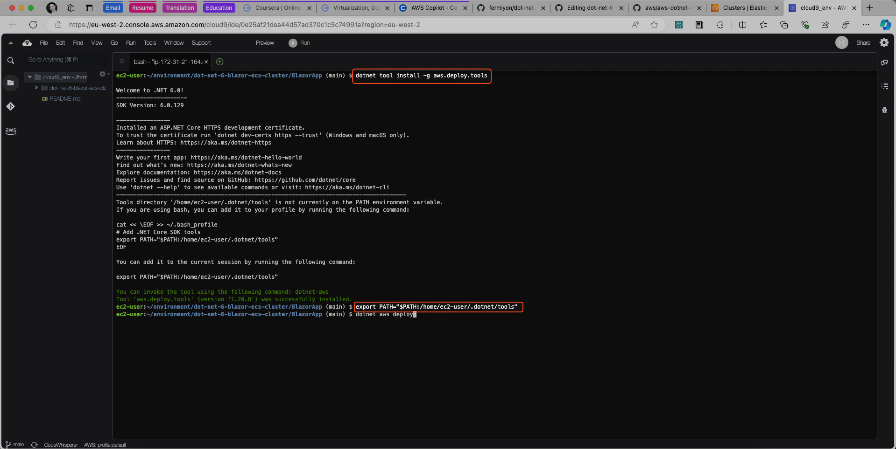
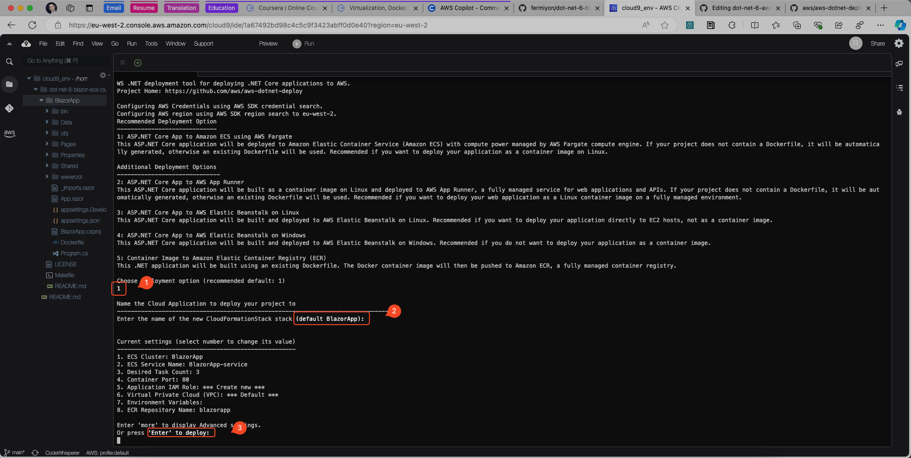
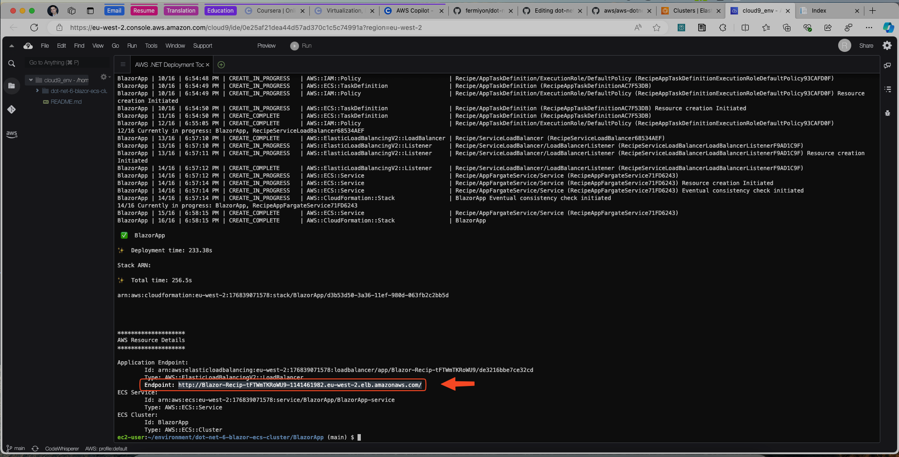
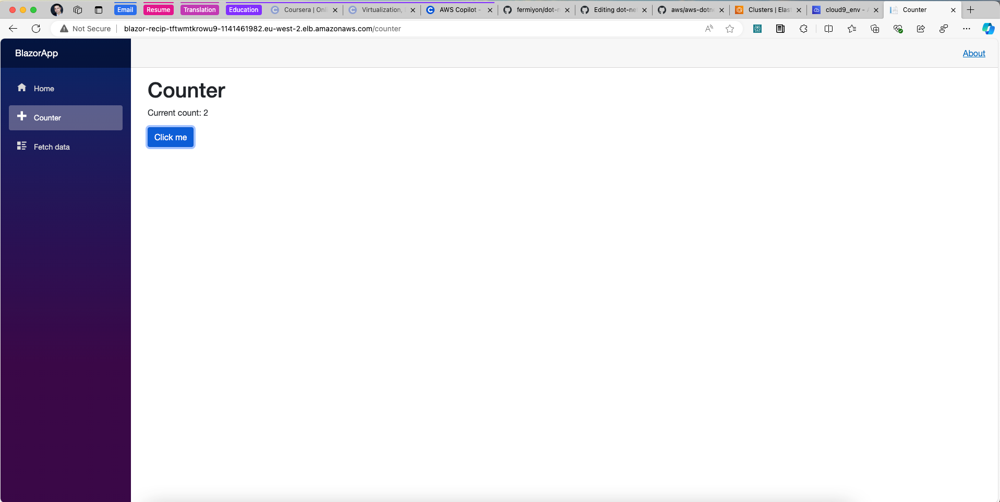
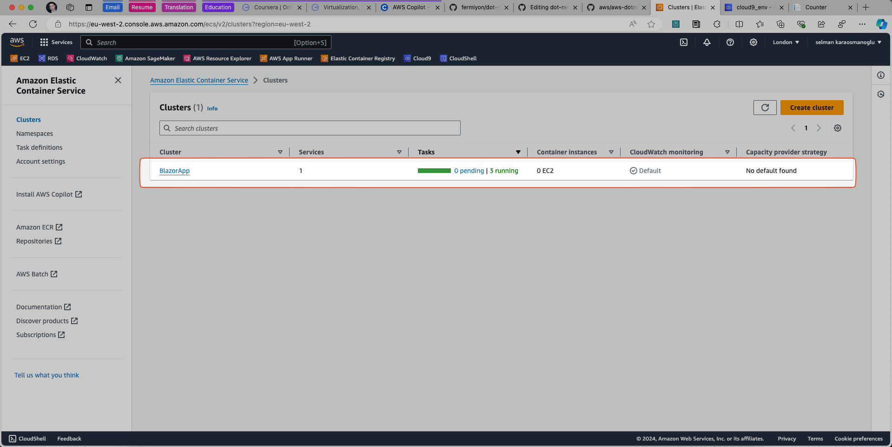

By Selman Karaosmanoglu 

## Date created

4 July 2024

# C# .NET 6 Docker Deployment on Scalable AWS Elastic Container Service(ECS) Cluster

.NET 6 on AWS for Containers using Cloud9

## Overview

This repository provides a guide for deploying .NET 6 applications on AWS ECS Cluster using Docker containers and Cloud9 environment.

## Architecture



## Getting Started

## Setting Up AWS Cloud9

### Create AWS Cloud9 Environment



### Install .NET 6 from Microsoft on AWS Cloud9

```bash
sudo rpm -Uvh https://packages.microsoft.com/config/centos/7/packages-microsoft-prod.rpm
sudo yum install dotnet-sdk-6.0
sudo yum install aspnetcore-runtime-6.0
sudo yum install dotnet-runtime-6.0
```

### Run dotnet

```bash
cd BlazorApp

dotnet run --urls=http://localhost:8080
```

### Preview

Preview running application



### Build Docker Image

The Dockerfile is as follows:

```bash
FROM mcr.microsoft.com/dotnet/sdk:6.0 AS build
WORKDIR /src
COPY ["BlazorApp.csproj", "./"]
RUN dotnet restore "BlazorApp.csproj"
COPY . .
WORKDIR "/src/."
RUN dotnet build "BlazorApp.csproj" -c Release -o /app/build
FROM build AS publish
RUN dotnet publish "BlazorApp.csproj" -c Release -o /app/publish
FROM mcr.microsoft.com/dotnet/aspnet:6.0 AS base
WORKDIR /app
EXPOSE 80
EXPOSE 443
WORKDIR /app
COPY --from=publish /app/publish .
ENTRYPOINT ["dotnet", "BlazorApp.dll"]
```

Run the below command to build docker image from Dockerfile.

```bash
docker build . -t web-service-dotnet:latest
```

### Run Docker image

```bash
docker run -p 8080:80 web-service-dotnet:latest
```




### Install AWS Deploy Tools

```bash
dotnet tool install -g aws.deploy.tools

export PATH="$PATH:/home/ec2-user/.dotnet/tools"
```



### Deploy Docker Image to AWS Elastic Container Service Cluster

This command builds the container and push this container to ECR and then set up cloud-based deploy using CloudFormation and AWS CDK. CDK generates CloudFormation code. 

All in all, this command handles all of these very complex steps. 

```bash
dotnet aws deploy
```





### Preview

Go to the URL of the endpoint to preview the deployed application.



### Control Amazon Elastic Container Service

Control Amazon ECS



## Reference

* Duke University - Virtualization, Docker, Kubernetes Data Engineering Program